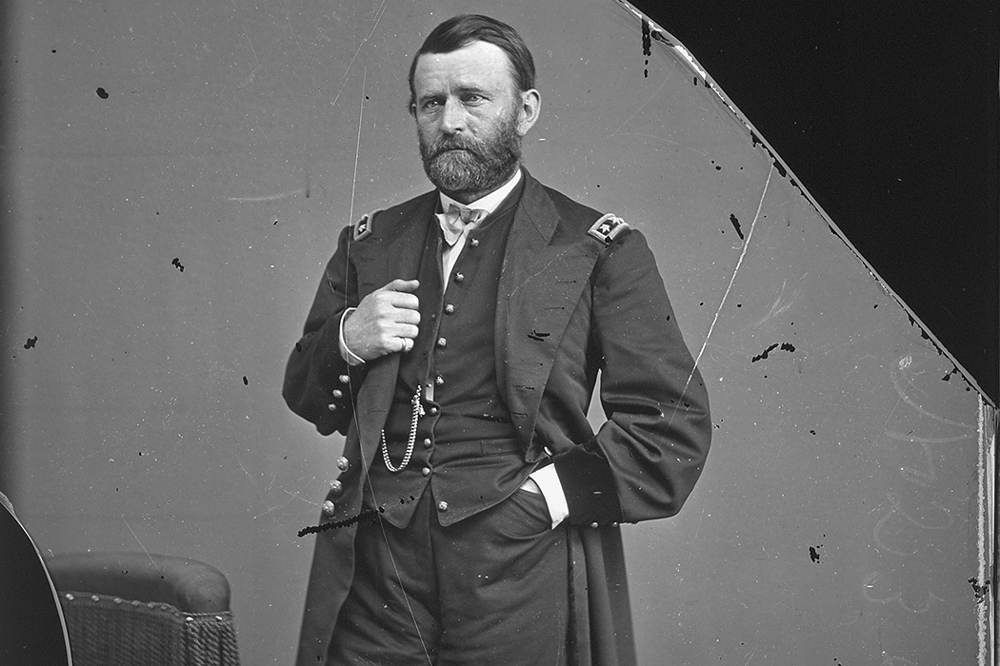

# Life of General Ulysses S. Grant.

Wherein Captain Galligasken modestly disparages himself, and sets
forth with becoming Enthusiasm the Virtues of the illustrious
Soldier whose Life he insists upon writing.
Who am I? It makes not the least difference who I am. If I shine at all
in this veritable history,—which I honestly confess I have not the
slightest desire to do,—it will be only in the reflected radiance of
that great name which has become a household word in the home 
of every loyal citizen, north and south, of this mighty Republic; a
name that will shine with transcendent lustre as his fame rings
along down the grand procession of the ages, growing brighter and
more glorious the farther it is removed from the petty jealousies of
contemporaneous heroes, statesmen, and chroniclers.
What am I? It does not make the least difference what I am. I
am to chronicle the deeds of that illustrious soldier, the
providential man of the Great Rebellion, who beat down the
strongholds of Treason by the force of his mighty will, and by a
combination of moral and mental qualifications which have been
united in no other man, either in the present or the past.
What was Washington? God bless him! A wise and prudent
statesman, a devoted patriot, the savior of the new-born nationality.
What was Napoleon? The greatest soldier of the century which
ended with the battle of Waterloo.
What was Andrew Jackson? The patriot statesman, who had a
will of his own.
What were Cæsar, Wellington, Marlborough, Scott? All strong
men, great soldiers, devoted patriots.
What is the Great Captain, the illustrious hero of the Modern
Republic? He is all these men united into one. He has held within
the grasp of his mighty thought larger armies than any other
general who is worthy to be mentioned in comparison with him,
controlling their movements, and harmonizing their action
throughout a territory vastly larger than that comprised in the
battle-grounds of Europe for a century.
Washington was great in spite of repeated defeats. Grant is
great through a long line of brilliant successes. Napoleon won
victories, and then clothed himself in the scarlet robes of an 
emperor, seated himself on a throne, and made his country's glory
only the lever of his own glory. Grant won victories not
less brilliant, and then modestly smoked his cigar on the grand
level of the people, diffidently accepting any such honors as a
grateful people thrust upon him.
As I yield the tribute of admiring homage to Washington that
he put the Satan of sovereign power behind him when he was
tempted with the glittering bait, I am amazed that Grant, the very
idol of a million veteran soldiers, permitted his sword to rest in its
scabbard while his recreant superior, by the accident of the
assassin's bullet, dared to thwart the will of the people whose
ballots had elevated him to power. I can almost worship him for
his forbearance under the keenest insults to which the sensitive
soul of a true soldier can be subjected, that he did not smite his
cunning traducer, and did not even appeal to the peo ple.
Who am I? If I am seen at all in this true narrative of a sublime
life, I beg to be regarded as the most humble and least deserving of
Columbia's chosen sons, but standing, for the moment, on a
pedestal, and blushingly pointing to the historic canvas, whereon is
delineated the triumphal career of the Great Man of the nineteenth
century; the successful General, towering in lofty preëminence
above every other man, who in the days of darkness struck a blow
for the redemption of the nation; the fledged Statesman, who,
without being a politician, apprehended and vitalized the chosen
policy of the sovereign people. I am nothing; he is everything.
I am an enthusiast!
Is there nothing in The Man, sublimated by glorious deeds,
elevated by a conquering will far above his fellows, almost deified by the highest development of godlike
faculties,—is there nothing in The Man to quicken the lazy flow in
the veins of the beholder? Can I, who marched from Belmont to
Appomattox Court House, by the way of Donelson, Vicksburg,
Chattanooga, Spottsylvania, Petersburg, and Five Forks, who have,
since the collapse of the rebellion, gazed, in common with the
Senators and Representatives in Congress, the Governors of the
states, the President, and the heads of the departments of state, the
sovereign people, with friends and with foes of the regenerated
country,—can I, who have gazed with the most intense interest at
the little two-story brick building in the nation's capital, where
smoked and labored the genius of the war, to see what that one
man would do, to hear what that one man would say,—can I gaze
and listen without realizing the throb which heaves the mighty
heart of the nation? I felt as they felt, that there was only one man
in the land. It mattered little what senators and representatives
enacted in the halls of Congress, if he did not indorse it. It mattered
little what the Nation's Accident vetoed, if he but approved it. It
was of little consequence what rebels north or rebels south planned
and plotted, if only this one man frowned upon it. Reconstruction
could flourish only in his smile. If a department commander
ambitiously or stupidly belied his war record, and attempted to
bolster up with this diplomacy the treason which he had put down
with his sword, the howl of the loyal millions was changed into a
shout of exultation, if the one man in the little two-story brick
building in Washington only nodded his disapproval of the course of the recreant. That man has
been the soul of the people's policy of reconstruction. Conscious
that he was its friend, it mattered not who was its enemy; for foes
could delay, but not defeat it.

Can I be unmoved while I look at The Man? When I behold a
huge steamship, the giant of the deep, threading its way through 
night and storm over the pathless ocean, from continent to
continent, herself a miracle to the eye, I wonder. When I see the
electric telegraph, flashing a living thought from farthest east to
farthest west, and even along its buried channel in the depths of the
storm-tossed ocean, I wonder. Can I gaze unmoved upon the Man,
the Fulton, the Morse, from whose busy brain, lighted up by an
inspiration from the Infinite, which common men cannot even
understand, came forth the grand conception of these miracles of
science?
I am an enthusiast. I cannot gaze at the spectacle of a nation
rent and shattered by the most stupendous treason that ever fouled
historic annals, restored to peace and unity, without a thrill of
emotion. I cannot follow our gallant armies in imagination now, as
I did in reality then, in their triumphal march from the gloom of
Fredericksburg and Chancellorsville to the glorious light and
sunshine of Vicksburg and Five Forks, from death at Bull Run, to
life at Fort Donelson, without having my heart leap with grateful
enthusiasm.
In the ghastly midnight of disaster, when the nation's pulse
almost ceased to beat in dread and anxiety for the fearful issue, we
had men—hundreds of thousands, millions of men, the bravest and truest soldiers that ever
bore a musket. Thousands and tens of thousands of them sleep
beneath the bloody sod of Antietam, in the miry swamps of the
Chickahominy, and under the parching soil of the southern
savannas, where they sank to their rest with the field unconquered
above them. There they slumber, each of them a willing sacrifice,
if his death brought the nation but one hair's breadth nearer to the
final redemption, or could add one ray to the flood of light which
the peace they prayed for would shed upon the land beloved.
